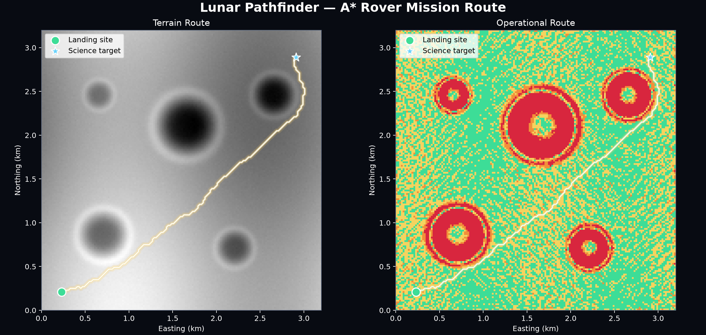

# Lunar Pathfinder

Lunar Pathfinder is a terrain-analysis and rover route-optimization
system for exploring the Moon's south-polar region.

The project converts elevation data into terrain products that can
support landing-site evaluation, rover traversability analysis, and
eventually energy-aware mission routing.



## Mission question

> Given a lunar terrain map, how can we calculate a rover route that
> balances distance, slope, surface hazards, energy, illumination, and
> communications?

## Current milestone

### v0.1.0-alpha.3 — Initial rover route optimization

Lunar Pathfinder now calculates terrain-aware rover routes using A*
search.

The initial synthetic mission produced a 4.415 km route across the test
site. The rover accepted a 16.48% distance increase while avoiding all
hazardous and blocked cells.

The complete project suite contains 46 passing tests.

## Run the project

Install dependencies:

```bash
uv sync

# Roadmap 
- `v0.1.0-alpha.1`: Terrain-analysis foundation — complete
- `v0.1.0-alpha.2`: Traversability classification — complete
- `v0.1.0-alpha.3`: Initial rover route optimization — complete
- `v0.2.0-alpha.1`: Real lunar elevation-data ingestion
- `v0.2.0-alpha.2`: Real lunar south-pole route
- `v0.3.0`: Illumination and energy modeling
- `v0.4.0`: Interactive mission-control viewer
- `v1.0.0`: Demonstrable lunar mission-planning system