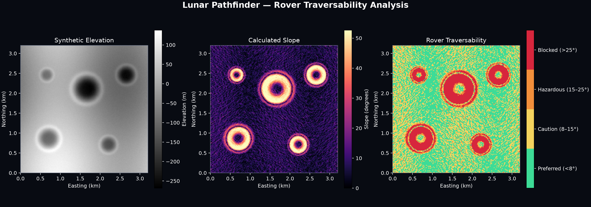

# Lunar Pathfinder

Lunar Pathfinder is a terrain-analysis and rover route-optimization
system for exploring the Moon's south-polar region.

The project converts elevation data into terrain products that can
support landing-site evaluation, rover traversability analysis, and
eventually energy-aware mission routing.



## Mission question

> Given a lunar terrain map, how can we calculate a rover route that
> balances distance, slope, surface hazards, energy, illumination, and
> communications?

## Current milestone

### v0.1.0-alpha.2 — Rover traversability classification

The current milestone converts terrain slope into four operational
classes: preferred, caution, hazardous, and blocked.

Of the synthetic test site's 10.24 km²:

- 49.46% is preferred
- 32.18% requires caution
- 6.05% is hazardous
- 12.30% is blocked

Blocked crater walls now form barriers that the next route-optimization
milestone must navigate around.

## Run the project

Install dependencies:

```bash
uv sync

# Roadmap 
- `v0.1.0-alpha.1`: Terrain-analysis foundation — complete
- `v0.1.0-alpha.2`: Traversability classification — complete
- `v0.1.0-alpha.3`: Initial rover route optimization
- `v0.2.0`: Real lunar elevation data
- `v0.3.0`: Illumination and energy modeling
- `v0.4.0`: Interactive mission-control viewer
- `v1.0.0`: Demonstrable lunar mission-planning system