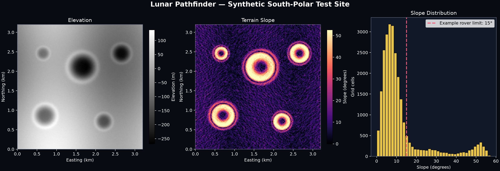

# Lunar Pathfinder

Lunar Pathfinder is a terrain-analysis and rover route-optimization
system for exploring the Moon's south-polar region.

The project converts elevation data into terrain products that can
support landing-site evaluation, rover traversability analysis, and
eventually energy-aware mission routing.



## Mission question

> Given a lunar terrain map, how can we calculate a rover route that
> balances distance, slope, surface hazards, energy, illumination, and
> communications?

## Current milestone

### v0.1.0-alpha.1 — Terrain-analysis foundation

The initial milestone provides:

- A tested Python 3.12 project
- Deterministic synthetic cratered terrain
- Terrain-slope calculation from elevation grids
- Reproducible summary statistics
- A presentation-ready elevation and slope visualization
- Automated Ruff and pytest quality gates

### Initial result

The synthetic test site represents a 10.24 km² region sampled at
20 meters per cell.

| Measurement | Result |
|---|---:|
| Grid shape | 160 × 160 |
| Elevation relief | 406.34 m |
| Mean slope | 12.26° |
| Maximum slope | 57.35° |
| Cells above provisional 15° limit | 4,699 |
| Fraction above provisional limit | 18.36% |

The steepest terrain is concentrated along crater walls and rims. This
creates meaningful obstacles for the route planner planned for later
milestones.

These results describe synthetic algorithm-development terrain, not a
real lunar location.

## Run the project

Install dependencies:

```bash
uv sync